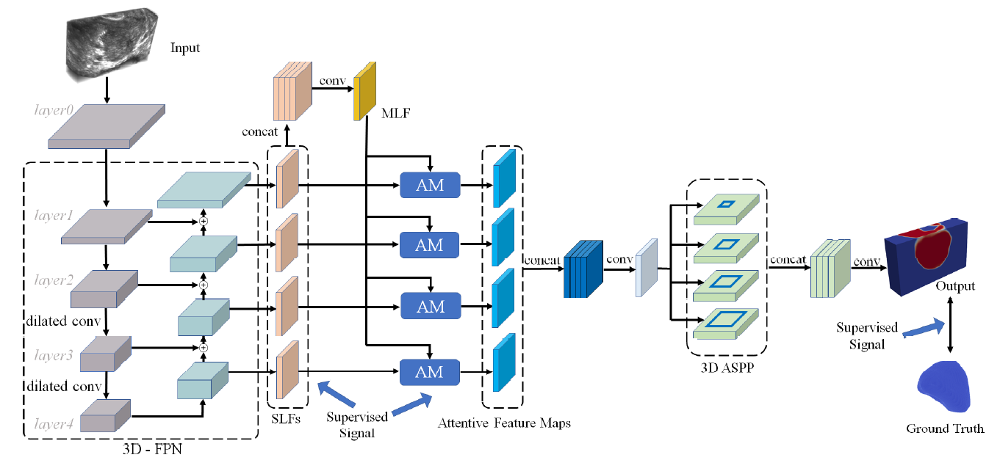
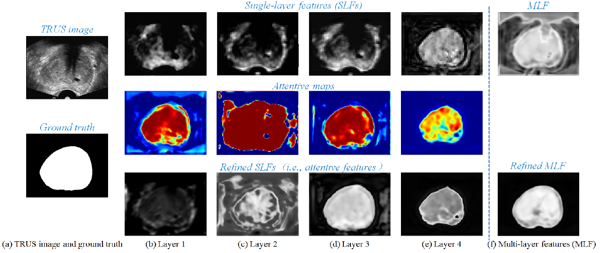

# Deep Attentive Features for Prostate Segmentation in 3D Transrectal Ultrasound. 
This repository is the implementation for the DAF3D by Haoran Dou in Shenzhen University  

Deep Attentive Features for Prostate Segmentation in 3D Transrectal Ultrasound.   
*Yi Wang, Haoran Dou, Xiaowei Hu, Lei Zhu, Xin Yang, Ming Xu, Jing Qin, Pheng-Ann Heng, Tianfu Wang, and Dong Ni.*  
IEEE Transactions on Medical Imaging(**IEEE TMI**), 2019.  
  
  

## Usage  
### Dependencies  
This work depends on the following libraries:  
Pytorch == 0.4.0  
Python == 3.6  

### Train and Validate
Run  
```
python Train.py
```
You can rewrite the DataOprate.py to train your own data.

## Result
One example to illustrate the effectiveness of the proposed attention module for the feature refinement.  
    
metric results  
  
| Metric    | 3D FCN | 3D U-Net | Ours   |
| ------    | ------ | ------   | ------ |
| Dice      | 0.8210 | 0.8453   | 0.9004 |
| Jaccard   | 0.6985 | 0.7340   | 0.8200 |
| CC        | 0.5579 | 0.6293   | 0.7762 |
| ADB       | 9.5801 | 8.2715   | 3.3198 |
| 95HD      | 25.113 | 20.390   | 8.3684 |
| Precision | 0.8105 | 0.8283   | 0.8995 |
| Recall    | 0.8486 | 0.8764   | 0.9055 |
  
## Citation  
If this work is helpful for you, please cite our paper as follow:   
```
@article{wang2019deep,  
  title={Deep Attentive Features for Prostate Segmentation in 3D Transrectal Ultrasound.},  
  author={Wang, Y and Dou, H and Hu, X and Zhu, L and Yang, X and Xu, M and Qin, J and Heng, PA and Wang, T and Ni, D},  
  journal={IEEE transactions on medical imaging},  
  year={2019}  
}
```
